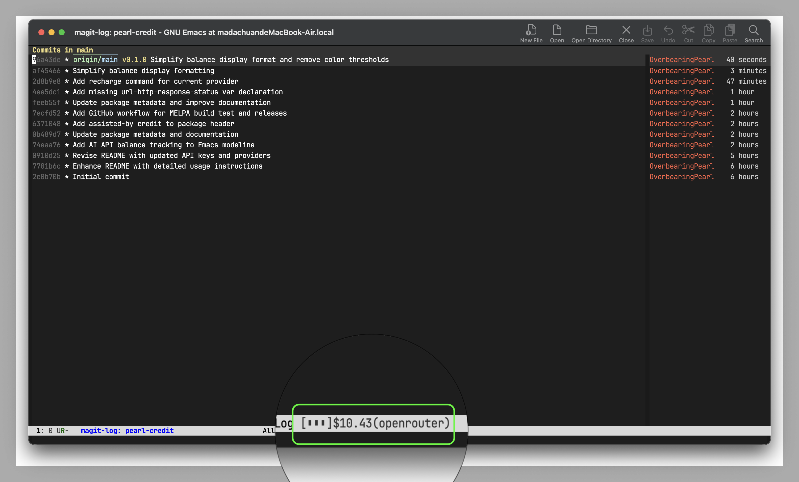

# pearl-credit

AI API balance in the Emacs modeline. No browser, no blocking, no fuss.



## Install

```elisp
(use-package pearl-credit
  ;; Optional: start with specific provider instead of first active
  ;; :custom
  ;; (pearl-credit-default-provider 'deepseek)
  :ensure t
  :bind (("C-c A r" . pearl-credit-refresh)
         ("C-c A c" . pearl-credit-cycle)
         ("C-c A s" . pearl-credit-switch-to-provider)
         ("C-c A S" . pearl-credit-status))
  :config
  (pearl-credit-mode 1))
```

## Setup

Add entries to `~/.authinfo` or `~/.authinfo.gpg`:

```
machine openrouter.ai password sk-or-v1-...
machine deepseek.com password sk-...
machine moonshot.cn password sk-...
```

`pearl-credit` reads your authinfo and polls supported providers automatically.

## Supported Providers

| Provider | Status | Balance Endpoint |
|----------|--------|------------------|
| OpenRouter | yes | `https://openrouter.ai/api/v1/credits` |
| DeepSeek | yes | `https://api.deepseek.com/user/balance` |
| Moonshot | yes | `https://api.moonshot.cn/v1/users/me/balance` |
| Anthropic | no | No public balance API |
| OpenAI | no | No public balance API |

## Commands

- `M-x pearl-credit-refresh` — Force refresh all balances
- `M-x pearl-credit-cycle` — Switch to next provider in rotation
- `M-x pearl-credit-switch-to-provider` — Jump directly to a specific provider (with completion)
- `M-x pearl-credit-recharge-current` — Open browser to current provider's recharge page
- `M-x pearl-credit-status` — Show all provider balances in tooltip format
- `M-x pearl-credit-mode` — Toggle display on/off

## Display Format

Balances appear as `[▮▯▯]$2.00(openrouter)` with 3‑character Unicode bars:

- `[   ]` — Balance ≤ 0
- `[▯▯▯]` — Balance ≤ 1.0
- `[▮▯▯]` — Balance ≤ 2.0
- `[▮▮▯]` — Balance ≤ 10.0
- `[▮▮▮]` — Balance > 10.0

`~` suffix: Stale data (last fetch failed)

## Variables

### Display

- `pearl-credit-default-provider` — Default provider to display on startup
  - `nil` (default): Start with the first active provider
  - Symbol like `openrouter`, `deepseek`, or `moonshot`: Jump to that provider if active

Example: `(setq pearl-credit-default-provider 'deepseek)`

### Timing

- `pearl-credit-poll-interval` — Seconds between automatic updates (default: 300)
- `pearl-credit-timeout` — HTTP request timeout (default: 10)

## License

GPL-3.0-or-later
